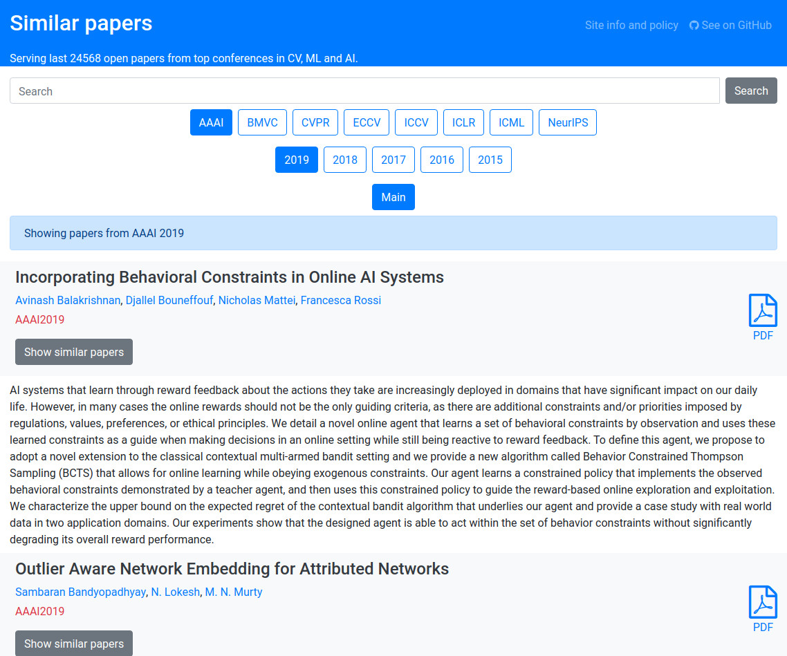

# Similar Papers

This code is a modification of the nice [arxiv-sanity](https://github.com/karpathy/arxiv-sanity-preserver) project. It provides a web interface to browse and find similar papers from top conferences in Computer Vision, Machine Learning and Artificial Intelligence.  This code is currently running live at [similarpapers.com](https://similarpapers.com/).



### Getting the code

If you just want to download the source code, then you can clone this repository with:
```bash
git clone https://github.com/hmorimitsu/similarpapers.git
```

However, if you want to download the source code and the metadata of the conference papers, then clone recursively with:
```bash
git clone https://github.com/hmorimitsu/similarpapers.git --recurse-submodules
```

### Code layout

It is mostly similar to the arxiv-sanity code. The explanation below is based on the arxiv-sanity one, with some modifications.

There are two large parts of the code:

**Indexing code**. Download the most recent papers from the available conferences, extracts all text, creates tfidf vectors based on the content of each paper. This code is therefore concerned with the backend scraping and computation: building up a database of papers, calculating content vectors, creating thumbnails, computing paper similarities, etc.

**User interface**. Then there is a web server (based on Flask) that allows searching through the database and filtering papers by similarity, etc.

### Dependencies

Several: You will need numpy, feedparser (to process xml files), scikit learn (for tfidf vectorizer), flask (for serving the results), flask_limiter. Also dateutil, and scipy. Most of these are easy to get through `pip`, e.g.:

```bash
$ virtualenv env                # optional: use virtualenv
$ source env/bin/activate       # optional: use virtualenv
$ pip install -r requirements.txt
```

You will also need [pdftotext](https://poppler.freedesktop.org/), which you can install on Ubuntu as `sudo apt-get install poppler-utils`.

### Processing pipeline

The processing pipeline requires you to run a series of scripts, and at this stage I really encourage you to manually inspect each script, as they may contain various inline settings you might want to change. In order, the processing pipeline is:

1. Run the fetcher for the selected conference. Some fetchers are available in the directory `fetchers`, and you may create your own for other conferences. All fetchers will append the data to a file `db.p`. You may run fetchers one after another and they will all write to the same `db.p` file, without destroying previous data. However, you cannot run multiple fetchers at the same time. You can interrupt the script and restart it, and it should skip papers that are already in the database.
2. Run `download_pdfs.py`, which iterates over all papers in parsed pickle and downloads the papers into folder `data/pdf`
3. Run `parse_pdf_to_text.py` to export all text from pdfs to files in `data/txt`
4. Run `analyze.py` to compute tfidf vectors for all documents based on bigrams. Saves a `tfidf.p`, `tfidf_meta.p` and `sim_dict.p` pickle files.
5. Run `make_cache.py` for various preprocessing so that server starts faster.
6. Run the flask server with `serve.py`. Visit localhost:5000 and enjoy sane viewing of papers!

### Running online

If you'd like to run the flask server online (e.g. AWS), you can probably use tornado and run `python serve.py --prod`, like the arxiv-sanity. However, I have not tried it myself.

The way [similarpapers.com](https://similarpapers.com/) is served is by using [Dokku](http://dokku.viewdocs.io/dokku/) with [Gunicorn](https://gunicorn.org/). If you want to serve in this way, I suggest you follow [this tutorial](https://www.linode.com/docs/applications/containers/deploy-a-flask-application-with-dokku/) and adapt it accordingly. This code should run without any modifications.

You also want to create a `secret_key.txt` file and fill it with random text (see top of `serve.py`).

### Current workflow

Running the site live is not currently set up for automatic operation. Instead, I run the pipeline on a local machine to update all the databases whenever a new conference comes up and then upload the processed databases to the website.
